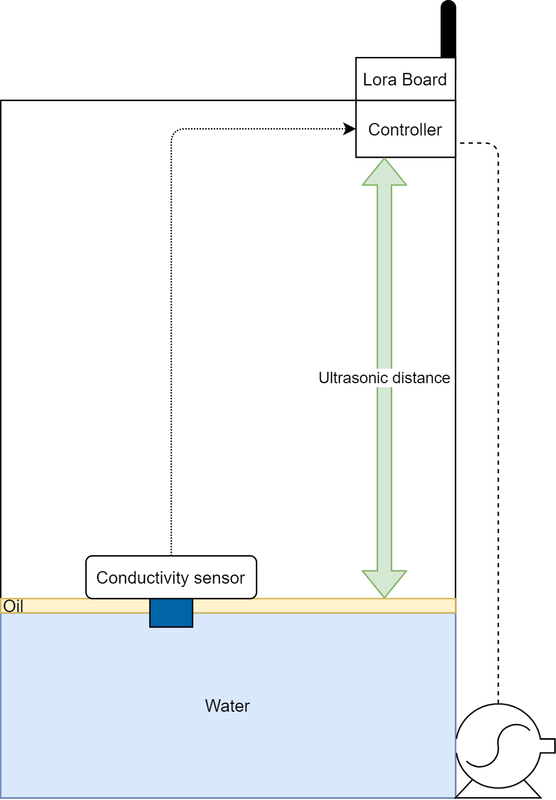
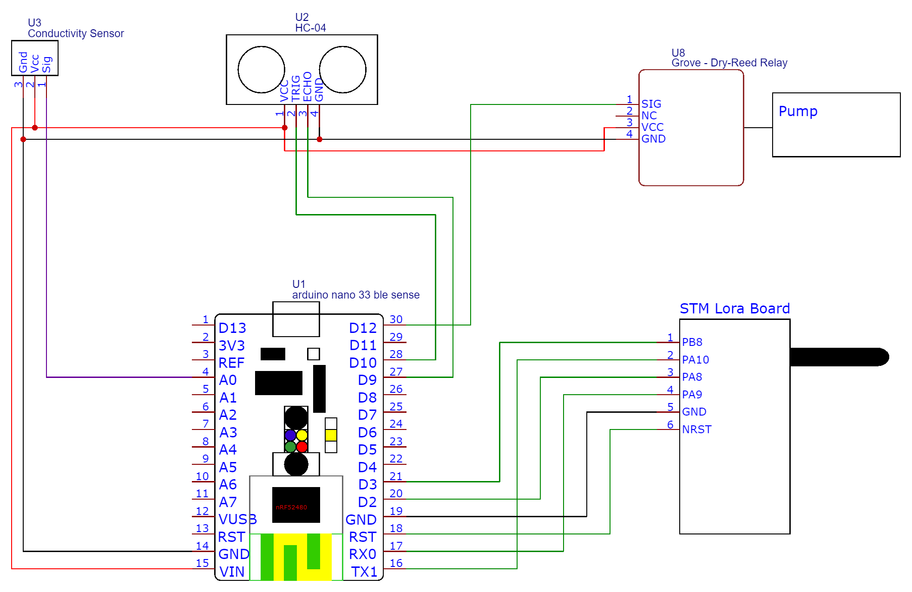
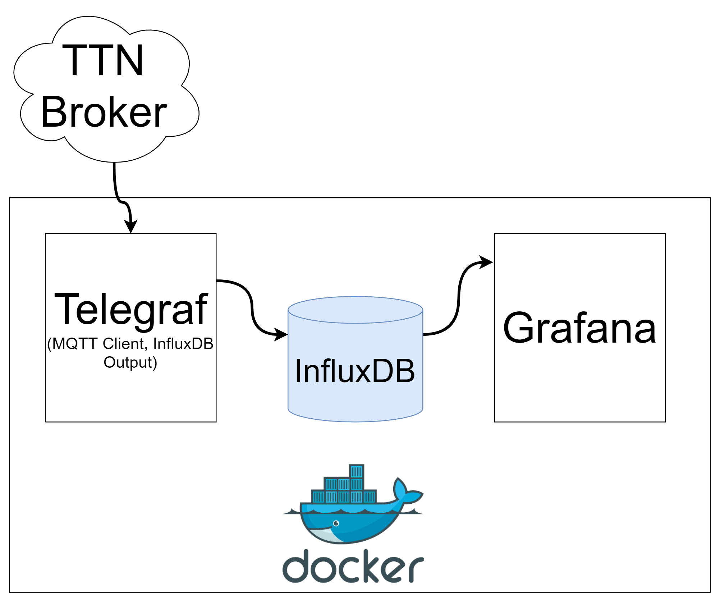
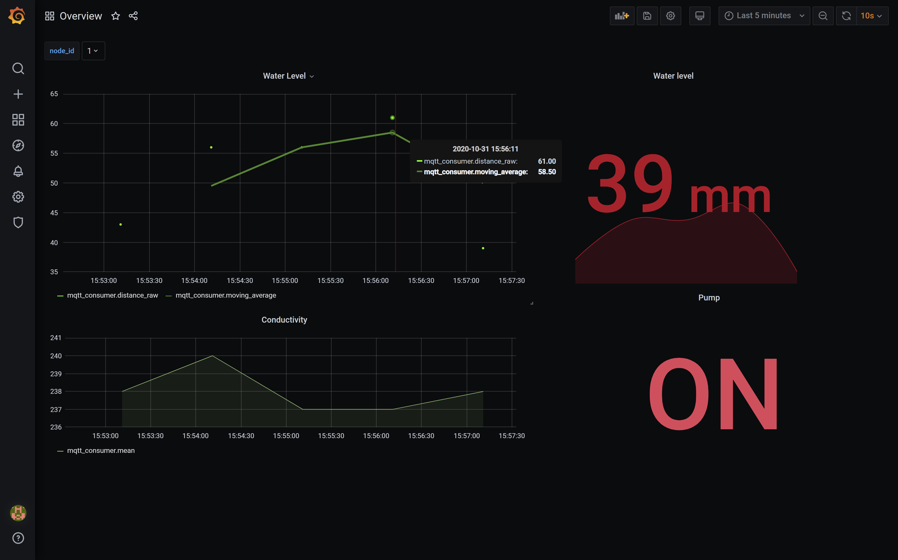
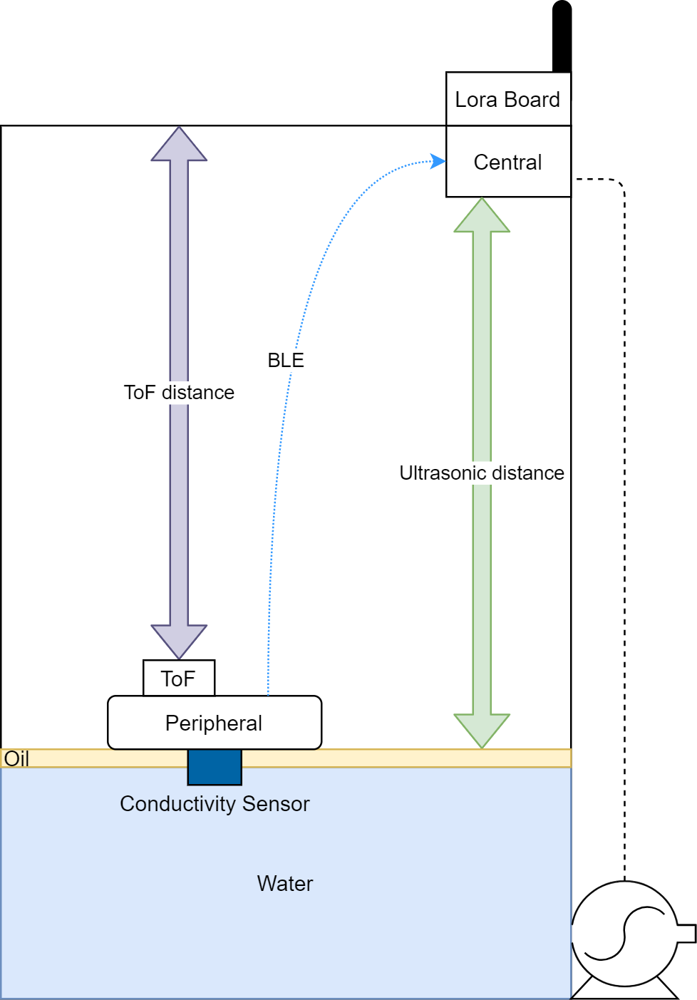
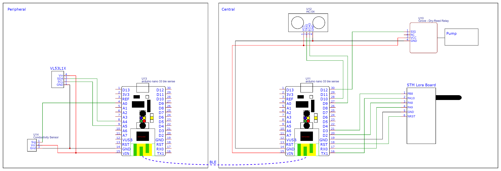

# mz-transformerstation


## Concept



## Data

### Payload structure

Byte|description
-|-
0|node id
1|water conductivity `[0..255]`
2|distance (high byte)
3|distance (low byte)
4|pump_state


### Payload decoding (TTN Console)

```js
function Decoder(bytes, port) {
  // Decode an uplink message from a buffer
  // (array) of bytes to an object of fields.
  var decoded = {};

   if (port === 1){
    
    decoded.node_id = bytes[0];
    decoded.conductivity = bytes[1];
    decoded.distance = (bytes[2]<<8)+bytes[3];
    decoded.pump_state = bytes[4];
   }

  return decoded;
}
```

## Hardware

- [Arduino Nano BLE Sense](https://store.arduino.cc/arduino-nano-33-ble-sense)
- [Murata B-L072Z-LRWAN1 board](https://www.st.com/resource/en/data_brief/b-l072z-lrwan1.pdf)
- [HC-SR04](https://cdn.sparkfun.com/datasheets/Sensors/Proximity/HCSR04.pdf)
- [Grove Water Sensor](https://wiki.seeedstudio.com/Grove-Water_Sensor/)
- Relay Module

### Wiring




## Backend



- [docker-compose](https://docs.docker.com/compose/) (see [docker-compose-file](docker/docker-compose.yml))
  - [Telegraf](https://www.influxdata.com/time-series-platform/telegraf/) agent in a container (to subscribe to the TTN MQTT Broker)
  - [InfluxDB](https://www.influxdata.com/products/influxdb-overview/) container (store data)
  - [Grafana](https://grafana.com/) container (visualize data)


## Vizualisation

The vizualisation of the data is done with Grafana. The screenshot below shows the dashboard.



Legend
plugin|description
-|-
top-left|time series graph which shows the water level
top-right|the actual water level
bottom-left|time series graph which shows the conductivity
bottom-right|state of the pump

## Concept with two controllers communicating over BLE



To avoid having a wire between the floating conductivity sensor and the controller, it can be replaced with ble. To add redundancy to the water level measurement, an additional ToF distance sensor can be used.

### Wiring




